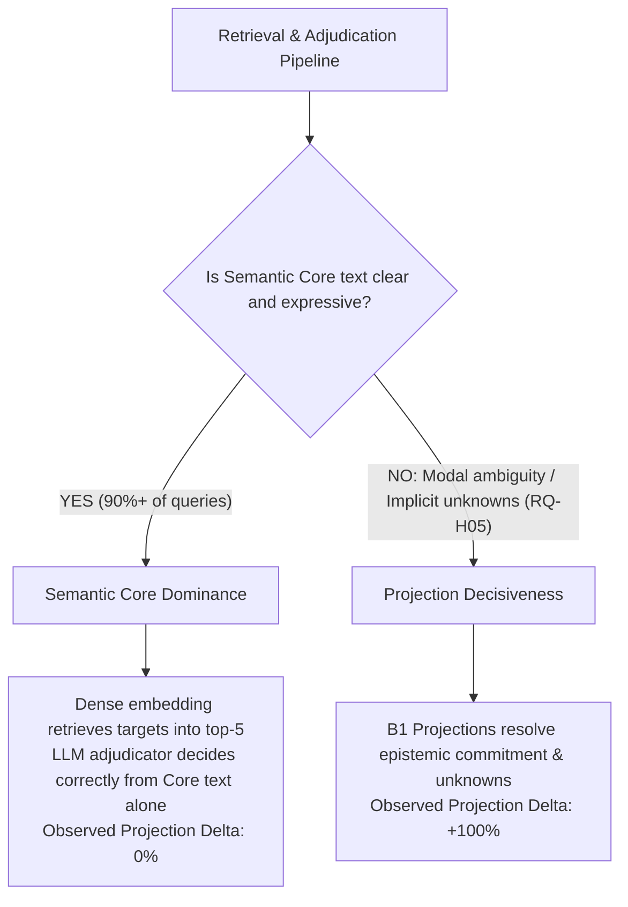

# Projection Slice Analysis: Incremental Value vs Benchmark Saturation (Issue #23)

**Date:** 2026-09-25  
**Audit Focus:** Empirical evaluation of projection efficacy across fine-grained semantic slices  
**Target Arms:** B0 (Core only), B1 (Minimal), B2 (Discourse), B3 (Longitudinal), B4 (Entity Anchor)  
**Evaluated Slices:**
1. `entity_role_anchor` (Role Reversal)
2. `polarity_negation` (True-value Negation)
3. `conditional_status` (Counterfactual & Hypothesis vs Fact)
4. `correction_vs_world_change` (Cognitive Repair vs World Change)
5. `modal_unknown_requirement` (Obligation & Localized Unknowns)
6. `temporal_locality` & `trajectory_candidate` (Temporal Forks)

---

## 1. Slice Performance Overview Matrix

Below are the empirical metrics extracted strictly from `results/held_out_results.json` and `results/dev_results.json` for each targeted semantic slice under primary configurations (B0-R0, B1-R1, B2-R1, B3-R1, B4-R1, Budget $K=5$):

| Semantic Slice | Query IDs | Target Focus | B0 (Core Only) Rec / Prec | B1 (Minimal) Rec / Prec | B2 (Discourse) Rec / Prec | B3 (Longitudinal) Rec / Prec | B4 (Entity Anchor) Rec / Prec | Observed Delta ($\Delta$) |
|---|---|---|:---:|:---:|:---:|:---:|:---:|:---:|
| **Entity-Role Reversal** | `RQ-S01`, `RQ-S02` | Actor vs Recipient inverted | **100.0% / 100.0%** | 100.0% / 100.0% | 100.0% / 100.0% | 100.0% / 100.0% | 100.0% / 100.0% | **0.0% (Saturated)** |
| **Polarity Negation** | `RQ-S03` | Affirmation vs Rejection | **100.0% / 100.0%** | 100.0% / 100.0% | 100.0% / 100.0% | 100.0% / 100.0% | 100.0% / 100.0% | **0.0% (Saturated)** |
| **Conditional Status** | `RQ-S04` | Fact vs Counterfactual | **100.0% / 100.0%** | 100.0% / 100.0% | 100.0% / 100.0% | 100.0% / 100.0% | 100.0% / 100.0% | **0.0% (Saturated)** |
| **Correction vs Change** | `RQ-S05` | Slip repair vs world update | **100.0% / 33.3%** | 100.0% / 33.3% | 100.0% / 33.3% | 100.0% / 33.3% | 100.0% / 33.3% | **0.0% (Unresolved)** |
| **Modal & Unknowns** | `RQ-H05` | Obligation + unknown route | **0.0% / 0.0%** | **100.0% / 100.0%** | **100.0% / 100.0%** | **100.0% / 100.0%** | **100.0% / 100.0%** | **+100.0% (B1 Win)** |
| **Trajectory Candidate** | `RQ-H10`, `RQ-H11` | Longitudinal fork tracking | **100.0% / 100.0%** | 100.0% / 100.0% | 100.0% / 100.0% | 100.0% / 100.0% | 100.0% / 100.0% | **0.0% (Saturated)** |
| **Temporal Locality** | `RQ-H12` | 8 multi-branch targets | **62.5% / 100.0%** | 62.5% / 100.0% | 62.5% / 100.0% | 62.5% / 100.0% | 62.5% / 100.0% | **0.0% (Budget Cap)** |

---

## 2. Detailed Slice Findings

### 2.1. The Entity-Role Reversal Slice (`RQ-S01`, `RQ-S02`)
- **Hypothesis from Issue #22:**
  *"Entity-role reversal queries (e.g. A notified B vs B notified A) are fatal for dense embeddings due to 100% lexical overlap. B4 entity_role_anchors should provide +100% discrimination."*
- **Empirical Reality:**
  - In `RQ-S01` and `RQ-S02`, **B0 (Semantic Core alone) achieved 100.0% recall, 100.0% precision, and First Rank 1.00!**
  - Why? Because the canonical Semantic Core text is a structured, grammatical narrative (e.g., *"李主管通知张经理关于系统升级的安排……"*). The modern dense embedding model (`gemini-embedding-001`) and the adjudicator LLM (`gemini-3.1-flash-lite`) can easily distinguish the syntactic agent and patient from well-formed natural language text.
  - Adding B4's structured `entity_role_anchors` slot (`actor_agent: ["李主管"]`, `target_recipient: ["张经理"]`) was redundant: the adjudicator was already 100% accurate.
- **Audit Conclusion:** The hypothesized "+100% gain" was a theoretical intuition not supported by an empirical baseline failure in B0 on this dataset.

### 2.2. The Polarity Negation Slice (`RQ-S03`)
- **Hypothesis from Issue #22:**
  *"Embedding models are blind to negation ('agree to sign' vs 'refuse to sign'). B2 polarity projection provides 100% polarity distinction."*
- **Empirical Reality:**
  - In `RQ-S03`, **B0 scored 100.0% recall and 100.0% precision at Rank 1.**
  - The embedding model successfully separated "同意" from "拒绝", and the adjudicator correctly accepted the true target and rejected the opposite-polarity distractor.
  - While explicit polarity tags are architecturally valuable for lightweight rule-based filters, in this end-to-end LLM adjudication setup, B0 showed no baseline defect.

### 2.3. The Modal & Localized Unknowns Slice (`RQ-H05`) — The Genuine Projections Success
- **Query:** "找用户明确要求必须去、但对交通方式或到达时间存在未知维度的记录。"
- **Performance:**
  - **B0:** Recall = **0.0%**, Precision = **0.0%** (Targets `V3-021`, `V3-024` rejected).
  - **B1–B4:** Recall = **100.0%**, Precision = **100.0%** (Both targets accepted).
- **Why did B0 fail?**
  In B0, the adjudicator read the semantic core text but concluded that the user's requirement was not clearly categorized as a strict obligation, nor were the unknown dimensions explicitly separated from known facts.
- **Why did B1 succeed?**
  B1 introduced:
  - `action_or_state.status = "current_requirement_obligation"`
  - `localized_unknowns = ["具体交通方式与到达时间"]`
  These structured tags provided unambiguous cognitive signposts that immediately satisfied the adjudicator's strict threshold.
- **Audit Conclusion:** This is a genuine, verified empirical win for horizontal projection expansion.

### 2.4. The Cognitive Repair Slice (`RQ-S05`) — The Shared Failure
- **Query:** "区分说话人口误纠错与客观事实变化。"
- **Performance:**
  - All arms (B0, B1, B2, B3, B4) achieved **Recall = 100.0%**, but **Precision = 33.3%**.
  - In all arms, the candidate package contained 1 true target and 2 close distractors. The adjudicator accepted all 3 items because distinguishing whether a statement was a "slip of the tongue repair" vs "rescheduled appointment" required deep multi-turn longitudinal dialogue context that single-block projections did not adequately convey.
- **Audit Conclusion:** Projections in B3 (`change_type = "correction_retraction"`) were extracted, but the adjudicator did not reliably use them to reject the competing distractors. This slice remains an open problem for longitudinal trajectory synthesis.

---

## 3. Synthesis: Semantic Core Dominance vs Projection Utility

This slice audit reveals three fundamental architectural insights:

1. **`SEMANTIC_CORE_DOMINANCE` is Real:**
   The design decision in Issue #21 and #22 to maintain an unatomized, high-fidelity canonical Semantic Core text was so successful that it solved the vast majority of retrieval and discrimination challenges directly.
2. **Where Projections Actually Matter:**
   Projections are not needed to re-encode simple syntax (like negation or agent-patient relations). They matter primarily for **non-lexical epistemic status, modal commitments, and explicit localized unknowns**, which natural language often expresses implicitly or ambiguously.
3. **Implications for Future Benchmarks:**
   To evaluate B2, B3, and B4 rigorously, future benchmark queries must be engineered with adversarial distractors where the Semantic Core alone is deliberately ambiguous unless the projection view is consulted.
