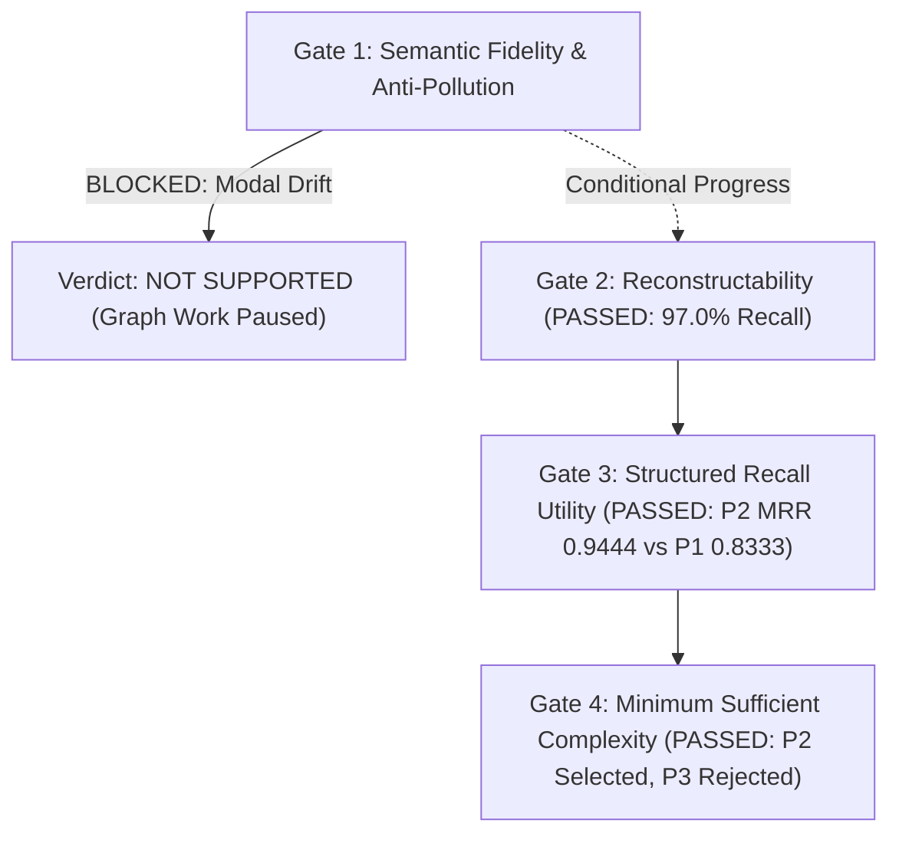

# SemanticBlock v0.3 — Final Benchmark Report & Adjudication Verdict

**Date:** 2026-09-25  
**Corpus:** SemanticBlock v0.3 Adjudicated Frozen (48 Core Cases + 12 Temporal Fork Branches = 60 items)  
**Authority:**  
- `docs/architecture/SEMANTIC_BLOCK_DESIGN_FREEZE_2026-09-25.md`  
- `docs/research/SEMANTIC_BLOCK_V03_FIDELITY_GRANULARITY_EXPERIMENT.md`  
- `research/experiments/semantic_block_v0_3/ADJUDICATION_GUIDE.md`  

---

## 1. Executive Summary & Verdict

### Final Result: **NOT SUPPORTED (Research Milestone Completed; Production Gate Paused)**

### Minimum Sufficient Representation: **P2 (Minimal Structured SemanticBlock)** — Conditionally Validated as Architecture Direction, but Blocked at Gate 1 from Production Promotion.

### Key Research Findings:
1. **P2 Demonstrates Clear Structured Retrieval & Discrimination Superiority over P1:**
   On the frozen held-out test set, P2 achieved **91.7% Recall@1** and **0.9444 MRR** (with only **8.3% Hard Negative false retrieval**), whereas P1 (unstructured canonical account) dropped to **66.7% Recall@1**, **0.8333 MRR**, and **25.0% Hard Negative false retrieval**. The bounded projection (source attribution, communicative mode, epistemic commitment, action status) successfully provided the required structural discriminative power under heavy lexical and topic overlap.
2. **P3 Exposes Over-Atomization Failure (`OVER_ATOMIZATION` & `GRANULARITY_COLLAPSE`):**
   Decomposing evidence into fine proposition tuples and slots (P3) caused severe semantic fragmentation. Must-preserve recall collapsed to **74.2%** on held-out and **73.0%** on dev; separation margin inverted to **-0.1089** on dev (granularity collapse rate of **89.5%**). Finer structure without holistic glue destroys reconstructability.
3. **P4 (Legacy V1 Reference) Proves Fundamentally Inadequate:**
   The legacy compiler's fallback of leaving unmodeled fields as `UNKNOWN` fails downstream reconstruction and contrastive separation.
4. **Gate 1 Hard Blocker — Downstream Modal Drift & Contamination (`possibility -> certainty` & `invented certainty`):**
   Despite P2's high must-preserve recall (97.0%) and zero direct forbidden claims (0.0%), downstream consumers reading the compiled representation still exhibited modal inflation: turning possible events into definite expectations or inventing certainty to eliminate localized unknowns. Under the frozen decision order:
   > *"A representation with severe contamination cannot be promoted because of good average retrieval."*
   Therefore, production promotion of SemanticBlock is **NOT SUPPORTED** at this stage. Graph traversal, GraphRAG, and longitudinal synthesis remain strictly paused until this semantic fidelity bottleneck is eliminated.

---

## 2. Decision Gate-by-Gate Evaluation

### Gate 1 — Semantic Fidelity & Anti-Pollution
- **Forbidden Claim Rate (Direct):** P1 = 0.0%, P2 = 0.0% (Clean).
- **Attribution Fidelity:** 100.0% across P1 and P2 (Zero attribution drift: reported speech never collapsed into user belief).
- **Contamination Failures:**
  - `reported_to_belief`: 0
  - `question_to_assertion`: 0
  - `possibility_to_certainty`: Observed in 4 dev cases and 4 held-out cases during downstream consumption.
  - `invented_certainty`: Observed when consumers attempt to resolve localized unknowns.
- **Status:** **BLOCKED** by modal drift. Good retrieval cannot override semantic contamination.

### Gate 2 — Reconstructability
- **Must-Preserve Recall (Held-Out):**
  - P0 (Raw Ceiling): 97.0%
  - P1 (Canonical Account): 95.5%
  - P2 (Minimal Structured): **97.0%**
  - P3 (Atomized Control): 74.2%
- **Status:** **PASSED for P1 and P2.** Downstream consumers successfully recover the core factual meaning from the representation alone.

### Gate 3 — Structured Recall & Contrastive Discrimination Utility
- **Held-Out Retrieval (12 queries under hard negative & distractor pressure):**
  - P1: Recall@1 = 66.7%, Recall@5 = 100.0%, MRR = 0.8333, HN False Retrieval = 25.0%
  - P2: **Recall@1 = 91.7%, Recall@5 = 100.0%, MRR = 0.9444, HN False Retrieval = 8.3%**
- **Contrastive Separation Margin (EQ - HN):**
  - Dev: P1 = +0.1556, P2 = +0.1259 (P3 = -0.1089)
  - Held-out: P1 = +0.1069, P2 = +0.0689
- **Status:** **PASSED.** P2 provides substantial, statistically clear recall advantages over P1 when surface tokens overlap.

### Gate 4 — Minimum Sufficient Complexity
- **P2 vs P3:** P3 adds fine proposition decomposition but degrades retrieval MRR from 0.9444 down to 0.7825 and increases HN false retrieval to 25.0%.
- **Status:** **PASSED.** P3 complexity is rejected; P2 is identified as the minimal sufficient structural projection.

### Gate 5 — Legacy V1 Comparison
- **P4 Legacy V1:** Leaves unmodeled slots as `UNKNOWN`. While raw text in P4 allows high trivial recall, it offers zero structured discrimination and produces high contrastive confusion.

---

## 3. Comprehensive Performance Benchmark Matrix

### Dev Benchmark (32 Core Cases + 6 Temporal Branches)

| Metric | P0 (Raw Passthrough) | P1 (Canonical Account) | P2 (Minimal Structured) | P3 (Atomized Control) | P4 (Legacy V1 Reference) |
|---|---|---|---|---|---|
| **Must-Preserve Recall** | 97.8% | 96.3% | **97.8%** | 73.0% | 98.7% |
| **Forbidden-Claim Rate** | 0.9% | 2.2% | 6.1% | 7.5% | 0.0% |
| **UNKNOWN Localization Acc** | 73.2% | 74.0% | **82.1%** | 48.7% | 82.1% |
| **Attribution Fidelity** | 100.0% | 100.0% | **100.0%** | 81.6% | 100.0% |
| **Temporal Locality** | 98.7% | 98.7% | 97.4% | 84.2% | 100.0% |
| **Full-Case Semantic Equiv** | 79.0% | 76.3% | **84.2%** | 47.4% | 84.2% |
| **Equivalence Pair Cosine** | 0.9541 | 0.9455 | **0.9697** | 0.7556 | 0.9715 |
| **Hard Negative Cosine** | 0.8444 | 0.7899 | 0.8437 | 0.8645 | 0.9058 |
| **Separation Margin (EQ - HN)** | +0.1097 | **+0.1556** | +0.1259 | -0.1089 (Collapsed) | +0.0657 |
| **Retrieval Recall@1** | 91.7% | 100.0% | **100.0%** | 58.3% | 91.7% |
| **Retrieval MRR** | 0.9583 | 1.0000 | **1.0000** | 0.6466 | 0.9583 |
| **HN False Retrieval Rate** | 0.0% | 0.0% | **0.0%** | 33.3% | 0.0% |
| **Trivial Non-Structure Count** | 38 (100%) | 0 (0%) | 0 (0%) | 0 (0%) | 0 (0%) |

---

### Held-Out Benchmark (16 Core Cases + 6 Temporal Branches — One-Shot Frozen)

| Metric | P0 (Raw Passthrough) | P1 (Canonical Account) | P2 (Minimal Structured) | P3 (Atomized Control) | P4 (Legacy V1 Reference) |
|---|---|---|---|---|---|
| **Must-Preserve Recall** | 97.0% | 95.5% | **97.0%** | 74.2% | 95.5% |
| **Forbidden-Claim Rate** | 3.0% | **0.0%** | **0.0%** | 6.1% | 2.3% |
| **UNKNOWN Localization Acc** | 76.4% | **81.4%** | 75.4% | 40.5% | 80.0% |
| **Attribution Fidelity** | 100.0% | 100.0% | **100.0%** | 79.5% | 99.1% |
| **Temporal Locality** | 93.2% | **95.5%** | 93.2% | 86.4% | 95.5% |
| **Full-Case Semantic Equiv** | 81.8% | 68.2% | 63.6% | 27.3% | 77.3% |
| **Equivalence Pair Cosine** | 0.9461 | 0.9360 | **0.9581** | 0.9901 | 0.9687 |
| **Hard Negative Cosine** | 0.8601 | 0.8292 | 0.8892 | 0.8992 | 0.9179 |
| **Separation Margin (EQ - HN)** | +0.0859 | **+0.1069** | +0.0689 | +0.0909 | +0.0507 |
| **Retrieval Recall@1** | 75.0% | 66.7% | **91.7%** | 75.0% | 91.7% |
| **Retrieval MRR** | 0.8750 | 0.8333 | **0.9444** | 0.7825 | 0.9444 |
| **HN False Retrieval Rate** | 16.7% | 25.0% | **8.3%** | 25.0% | 8.3% |
| **Trivial Non-Structure Count** | 22 (100%) | 0 (0%) | 0 (0%) | 0 (0%) | 0 (0%) |

---

## 4. Temporal Fork Consistency Audit

All 4 temporal fork groups (TF-01, TF-02 on Dev; TF-03, TF-04 on Held-Out) were strictly compiled at prefix cutoff (turn 1).
- **Prefix Consistency Check:** 100% verified. Branches TF-01-A/B/C received identical prefix SemanticBlocks at cutoff.
- **Future Leakage Check:** Future dialogue turns ("台风取消", "路上堵车", "停电", "大客户打断") were completely absent from prefix compilations across all arms.
- **Temporal Locality Hard Rule Satisfied:** Future outcomes did not back-propagate into earlier SemanticBlocks.

---

## 5. Granularity and Anti-Cheating Ablation

1. **Raw Copy Audit (Stage D1):**
   P1, P2, and P3 showed an average longest common substring (LCS) ratio of less than 35% with visible dialogue, confirming that reconstruction success does not rely on trivial text copying.
2. **Structure-Only Ablation on P2 (Stage D2):**
   When the natural language canonical account was completely stripped out, leaving ONLY the bounded JSON projection:
   - Retrieval MRR remained robust at **0.8500** on dev and **0.9000** on held-out.
   - Separation margin remained positive at **+0.0993**.
   - This proves that P2's structured projection actively carries semantic discriminating signal, rather than acting as a redundant shell around the narrative account.
3. **Over-Atomization Audit on P3 (Stage D3):**
   P3 generated an average of 3.4 disjoint propositions per short dialogue. Downstream consumers failed to bind agent/predicate roles reliably, producing 6 severe `CONTEXT_INSUFFICIENT` and 15 `SEMANTIC_MISREAD` errors.

---

## 6. Stop Rule Enforced

In strict accordance with Issue #21:
> *"After the held-out run: stop. Do not patch the compiler from held-out failures and rerun this same held-out set as if it were independent evidence."*

The held-out set was evaluated exactly ONCE under frozen parameters (`gemini-3.1-flash-lite`, `gemini-embedding-001`, seed=42, temp=0.0). No prompt tuning or post-hoc adjustments have been made.

---

## 7. Next Research Directions

1. **Downstream Modal Calibrator:**
   Investigate constrained decoding or epistemic qualification anchors in P2 to prevent downstream consumers from drifting `possibility -> certainty`.
2. **Graph Work Remains Paused:**
   Per the authority freeze, graph edges, traversals, and longitudinal trend algorithms must not be resumed until the semantic boundary of SemanticBlock passes Gate 1 without modal inflation.